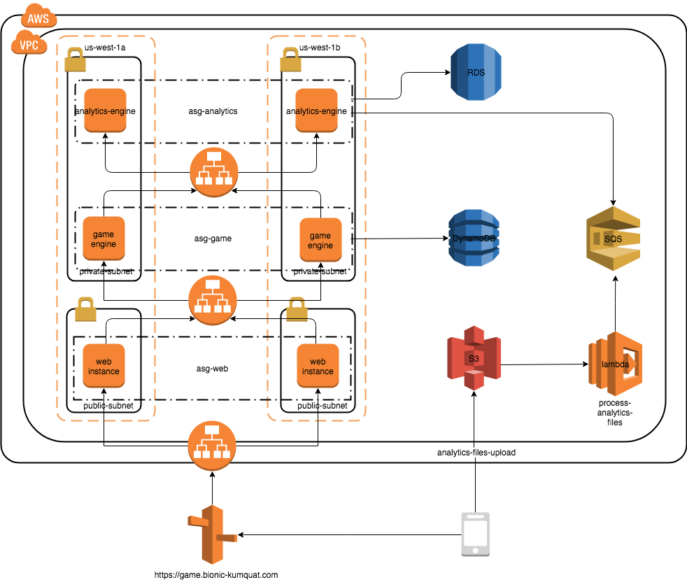

# Bionic Kumquat Games
Bionic Kumquat makes online, session-based, multiplayer games for the most popular mobile platforms. They build all of their games with some server-side integration, and has historically used separate bespoke backends for each of their games.

## Problem Definition
A few of their games were more popular than expected, and they had problems scaling their application servers, applications, MySQL databases, and analytics tools. Bionic Kumquat’s model is to write game statistics to files and send them through an ETL tool that loads them into a centralized MySQL database for reporting.

Bionic Kumquat is building a new game, which they expect to be very popular. They plan to deploy the game’s backend code using API driven development to standardise the interfaces in the development process in the cloud.

Once they have standardised their APIs they wish to migrate existing games into the new system so they can capture streaming metrics, run intensive analytics, and take advantage of its autoscaling environment, and integrate with a managed NoSQL database.

## Infrastructure Design
The system is comprised of the game backend platform and the game analytics platform.

The game backend platform should scale up or down dynamically based on game activity. It connects to a managed NoSQL database service and offers a structured standardized JSON API.

The game analytics platform also should scale up or down dynamically based on game activity. It processes incoming data on the fly directly from the game servers. It should support user SQL queries to access at least 10TB of historical data.

