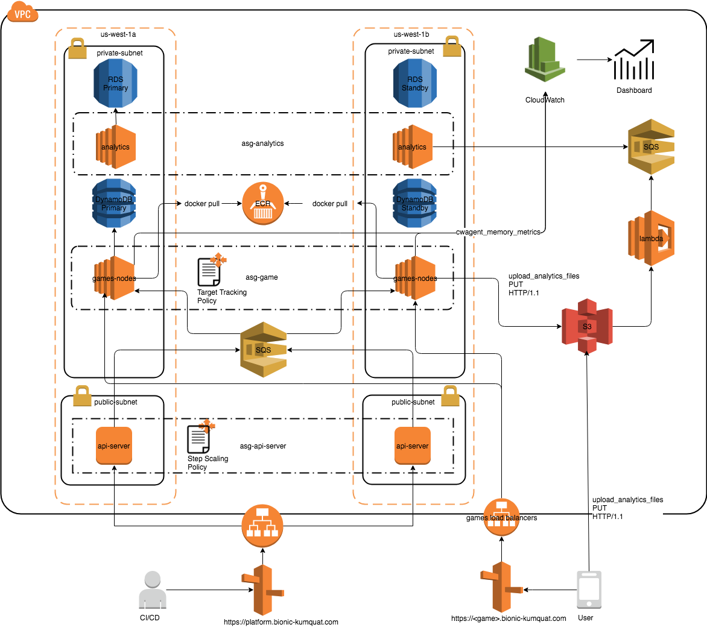

# Bionic Kumquat Games

## Table of Content

* [Introduction](#introduction)
* [Problem Definition](#problem-definition)
* [Prerequisites](#prerequisites)
* [Getting Started](#getting-started)
* [Testing](#testing)
* [Platform Design](#platform-design)

## Introduction
This project showcased how to use Terraform to provision a games hosting platform in the AWS environment. This project utilizs the following AWS services:

* Networking - VPC, subnet, internet gateway, ELB
* Compute - EC2, Autoscaling with step and target tracking policies
* Storage - S3, EBS
* Monitoring - Cloudwatch metrics and alarms
* Application - cloudinit

## Problem Definition
Bionic Kumquat makes online, session-based, multiplayer games for the most popular mobile platforms. They build all of their games with some server-side integration, and has historically used separate bespoke backends for each of their games.

A few of their games were more popular than expected, and they had problems scaling their application servers, applications, MySQL databases, and analytics tools. Bionic Kumquat’s model is to write game statistics to files and send them through an ETL tool that loads them into a centralized MySQL database for reporting.

Bionic Kumquat is building a new game, which they expect to be very popular. They plan to deploy the game’s backend code using API driven development to standardise the interfaces in the development process in the cloud.

Once they have standardised their APIs they wish to migrate existing games into the new system so they can capture streaming metrics, run intensive analytics, and take advantage of its autoscaling environment, and integrate with a managed NoSQL database.

## Prerequisites
The following is the list of prerequisites to provision the platform:

1. [Terraform v0.11.3](https://www.terraform.io/downloads.html)
1. [Awsume 2.1.5](https://github.com/trek10inc/awsume)
1. [Go 1.9.3](https://golang.org/dl/)
1. A valid (self-signed) SSL certificate.
1. An AWS account with full permissions to all the AWS services mentioned above.

## Getting Started
### Backend Bucket
In this project, Terraform is configured to use the S3 backend to store its statefile. The backend configurations can be defined in a `.tfvars` file. For example, to save my encrypted statefile in my `isim-ao` S3 bucket with the `bionic-kumquat` prefix, my backend `.tfvars` file looks like this:
```
bucket = "isim-ao"
key = "bionic-kumquat/terraform.tfstate"
encrypt = "true"
```

Now create the backend S3 bucket using either the AWS Console or CLI.

Once the backend bucket is set up, initialize Terraform with:
```
$ terraform init -backend-config <backend-config>.tfvars
```

### ELB Access Log Bucket
Create a second S3 bucket to store the platform's API Server ALB access logs. This bucket must be in the same region as the ALB.

The bucket must also have the appropriate bucket policy that grants Elastic Load Balancing permission to write access logs to itself. For more information on generating the correct bucket policy, refer to the AWS [docs](https://docs.aws.amazon.com/elasticloadbalancing/latest/application/load-balancer-access-logs.html#access-logging-bucket-permissions).

For example, if I want to store all the access logs in my us-west-2 `isim-ao` bucket, under the `api-server` prefix, my bucket policy looks like:
```json
{
  "Id": "Policy1520375176384",
  "Version": "2012-10-17",
  "Statement": [
    {
      "Sid": "Stmt1520375174133",
      "Action": [
        "s3:PutObject"
      ],
      "Effect": "Allow",
      "Resource": "arn:aws:s3:::isim-ao/api-server/AWSLogs/<aws-account-id>/*",
      "Principal": {
        "AWS": [
          "797873946194" # us-west-2 ELB account ID
        ]
      }
    }
  ]
}
```

### SSL Certificate
Upload a valid SSL certificate to the AWS Certificate Manager in the region of your platform. If needed, a self-signed certificate works too.

### Provision Platform
After the SSL certificate is successfully added, provision the platform with:
```
$ terraform apply
```

## Testing
This section provides test cases to verify the correctness of the platform.

### Load Testing
The Makefile contains some load testing targets which will be useful for development and testing purposes.

The following commands required Go to work:
```
$ make load-test/tool # download load testing tools
$ API_SERVER_ALB=<your_api_server_alb_hostname> make load-test/network/light
test -n "isim-ao-training-api-server-lb-137621501.us-west-2.elb.amazonaws.com" # Missing API Server ALB hostname
echo "GET http://xxxxxxxxxxx.<region>.elb.amazonaws.com/" | vegeta attack -duration=5s | tee results.bin | vegeta report
Requests      [total, rate]            250, 50.20
Duration      [total, attack, wait]    4.999494s, 4.979999s, 19.495ms
Latencies     [mean, 50, 95, 99, max]  20.091912ms, 19.678ms, 21.589ms, 28.606ms, 51.223ms
Bytes In      [total, mean]            2830250, 11321.00
Bytes Out     [total, mean]            0, 0.00
Success       [ratio]                  100.00%
Status Codes  [code:count]             200:250
Error Set:
```

## Platform Design
The platform is comprised of the _games backend_ and the _analytics backend_.

The games backend should scale up or down dynamically based on gaming activities. It is connected to a managed NoSQL database service and offers a structured standardized JSON API for games developer to deploy his games to the platform.

The analytics backend should scale up or down dynamically based on analytics activities. It processes incoming data on the fly directly from the games servers. It should support user SQL queries to access at least 10TB of historical data.

## Platform Components
This diagram depicts the key components of the platform.



### API Server
The API server handles HTTP and HTTPS requests from the games developer. The games developer deploys a game to the platform by sending a YAML payload to the API Server via HTTP and HTTPS requests. Upon receiving the payload, the API Server validates the payload and sends it to a SQS queue.

The elasticity of the API Servers cluster is managed by an Autoscaling Group whichdefines policy to grow and shrink the cluster based on the EC2 instances CPU utilization and the ELB network traffic. Cloudwatch metrics and _step scaling policies_ are defined to support this behaviour.

An Application Load Balancer fronts the API servers cluster with listeners defined at ports 80 and 443. The _https_ listener performs SSL termination prior to forwarding traffic to the target group.

Each EC2 instance utilizes cloudinit to run a set of scripts.

### Games
The Games nodes host all the games applications. The nodes wait for deployment payload to arrive on a SQS queue. Each payload will contain all the necessary informationon how to deploy the corresponding game (for e.g., the location of the Docker image etc.).

An autoscaling group is defined to manage the elasticity of the Games nodes using target tracking CPU and network-in policies.

Every EC2 instance has an ESB volume attached to it at the default location of `/opt/games/data`.

### To-Do's

1. Custom memory metrics for games nodes
1. Provision SQS.
1. SQS client on API Server.
1. Lambda to picks up files from S3 buckets.
